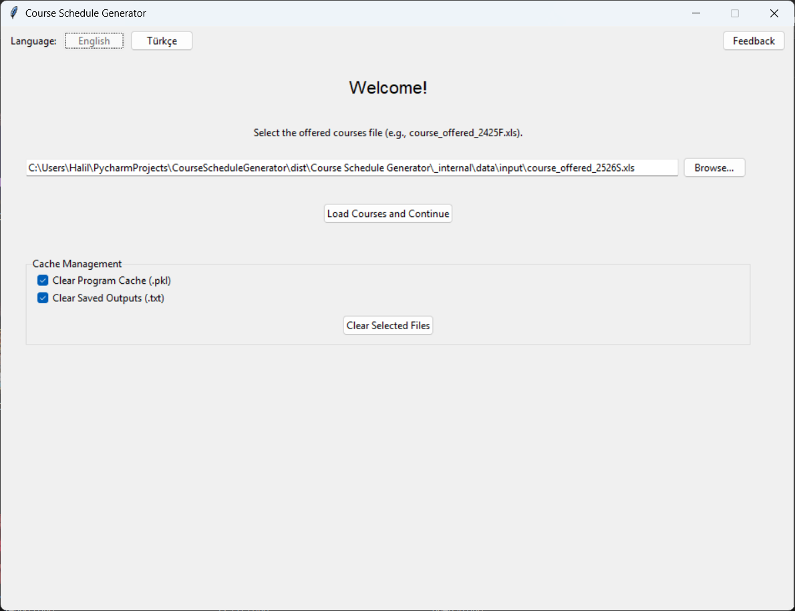
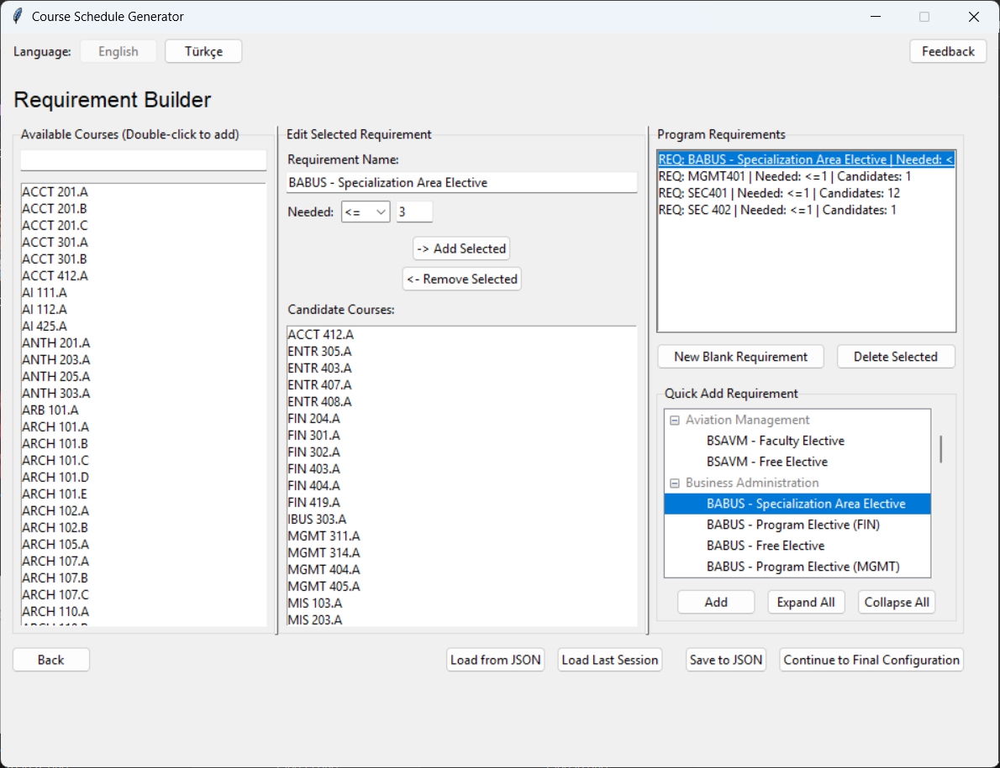
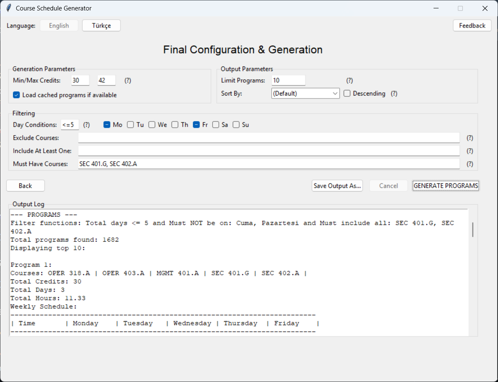
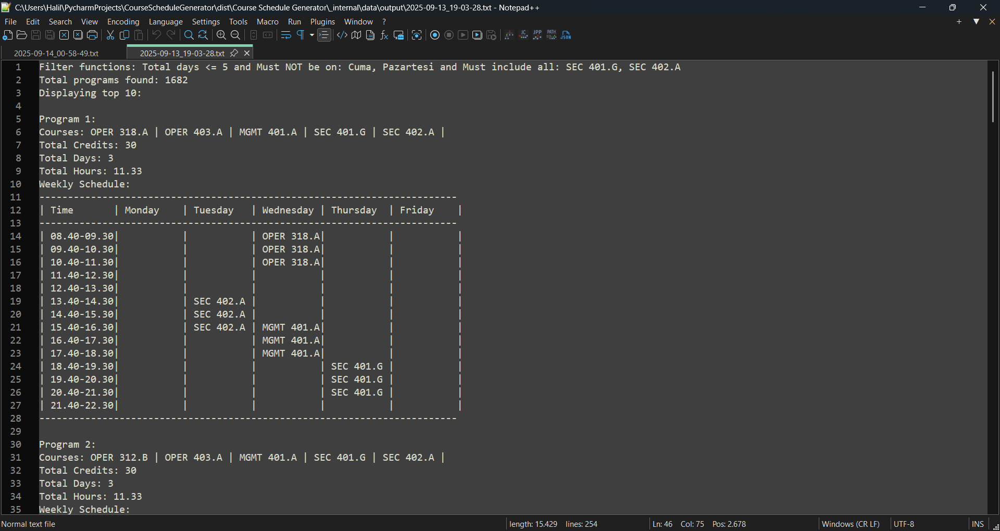
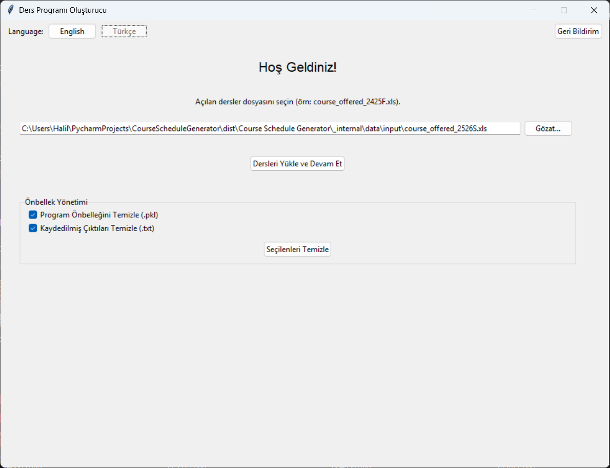
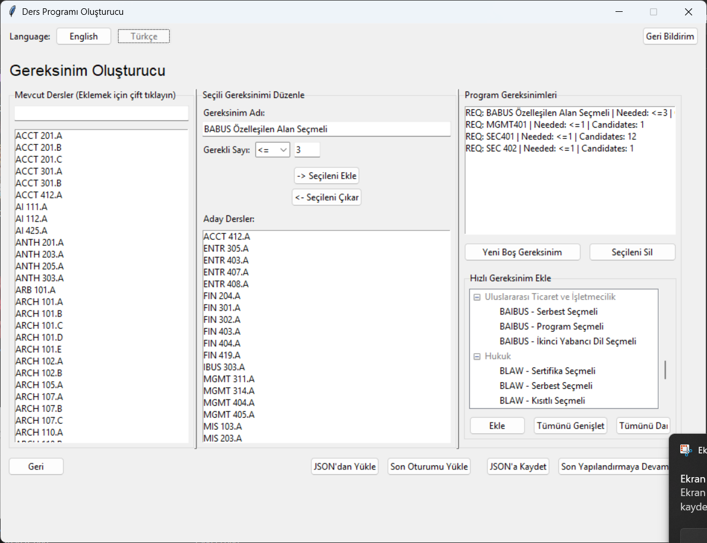
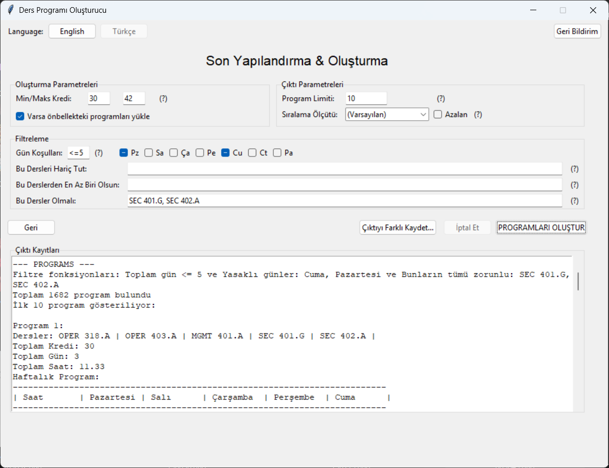
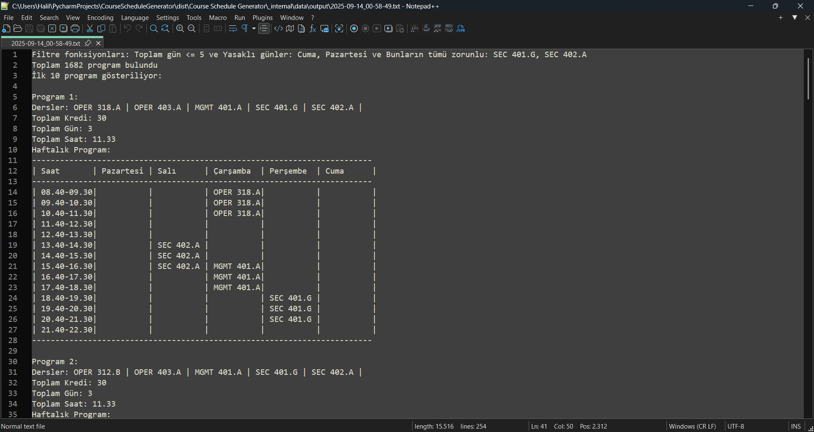

# Course Schedule Generator

[English](#english) | [Türkçe Versiyon İçin Tıklayınız](#türkçe)

[](https://opensource.org/licenses/MIT)

An intelligent desktop application designed to automate the creation of conflict-free Özyeğin University course schedules through an intuitive, bilingual Graphical User Interface (GUI).

---

<a name="english"></a>
## 🇬🇧 Course Schedule Generator (English)

This application solves the complex and tedious task of manual course scheduling. It takes a list of all offered courses and a customizable set of student-defined requirements, then uses a powerful backtracking algorithm to generate every possible valid, conflict-free program.

### ✨ Key Features

*   **🖥️ Full Graphical User Interface:** A user-friendly, standalone desktop application that guides you through the process from start to finish. No technical skill required.
*   **🌐 Bilingual Support:** The entire interface can be switched between English and Turkish **instantly** with a single click.
*   **🚀 High-Performance Caching:** A two-layer caching system dramatically speeds up generation. It caches both the parsed course data and the final program results, making subsequent runs incredibly fast.
*   **📋 Advanced Requirement Builder:**
    *   Easily create, edit, save, and load complex requirement sets.
    *   A scrollable "Quick Add" panel features dozens of predefined requirements for nearly every university department.
    *   Supports different Excel formats by accepting either "Ders" or "Course" as a valid column header.
*   **⚙️ Powerful Filtering & Sorting:**
    *   Filter generated programs by credit load, number of school days, and specific days of the week (e.g., no Friday classes).
    *   Include or exclude specific courses from the results.
    *   Sort the final list by total days, credits, or hours using a simple dropdown menu.

### 📸 Screenshots

*(Here you can add your screenshots. Just replace the placeholder text with the path to your images.)*

|               Screen 1: Setup & Cache Management                |               Screen 2: Requirement Builder               |
|:---------------------------------------------------------------:|:---------------------------------------------------------:|
|  |  |

|                     Screen 3: Generation & Filtering                     |               Example Output Schedule               |
|:------------------------------------------------------------------------:|:---------------------------------------------------:|
|  |  |

### 📦 Installation (For End-Users)

You do not need Python or any other tools installed to run this application.

1.  Go to the [**GitHub Releases**](https://github.com/YOUR_USERNAME/YOUR_REPOSITORY/releases) page for this project.
2.  Download the correct `.zip` file for your operating system (`Windows` or `macOS`).

#### For Windows:
1.  Unzip the downloaded folder (e.g., `Course-Schedule-Generator-v2.0-Windows.zip`).
2.  Open the unzipped folder and double-click **`Course Schedule Generator.exe`** to run.
3.  Windows may show a "Windows Protected your PC" security warning. This is normal. Click **"More info"**, then click **"Run anyway"**.

#### For macOS:
1.  Unzip the downloaded file. This will give you the `Course Schedule Generator.app`.
2.  Drag **`Course Schedule Generator.app`** into your **Applications** folder.
3.  The first time you run it, you may need to **right-click** the app icon and select **"Open"** to approve the security exception.

### 🚀 How to Use

1.  **Step 1: Load Courses**
    *   On the first screen, click "Browse..." to select the master Excel file of offered courses for the semester.
    *   Click "Load Courses and Continue".

2.  **Step 2: Build Requirements**
    *   Use the "Quick Add Requirement" panel on the right to add predefined requirement templates. You can also create new blank requirements.
    *   Select a requirement from the list to edit it in the center panel.
    *   Add candidate courses from the "Available Courses" list on the left by double-clicking them.
    *   You can save your requirement set to a `.json` file or load a previous session.

3.  **Step 3: Configure and Generate**
    *   Set your desired minimum/maximum credit load.
    *   Choose how you want the results sorted.
    *   Apply powerful filters, such as setting a maximum number of school days or excluding specific days.
    *   Click **"GENERATE PROGRAMS"** and view the results in the output log.

### 👨‍💻 For Developers

If you want to run the application from the source code:

1.  **Clone the repository:**
    ```bash
    git clone https://github.com/YOUR_USERNAME/YOUR_REPOSITORY.git
    cd CourseScheduleGenerator
    ```

2.  **Create and activate a virtual environment:**
    ```bash
    # For Windows
    python -m venv venv
    venv\Scripts\activate

    # For macOS/Linux
    python3 -m venv venv
    source venv/bin/activate
    ```

3.  **Install dependencies:**
    ```bash
    pip install -r requirements.txt
    ```

4.  **Run the application:**
    ```bash
    python src/main_gui.py
    ```

### 🛠️ Building from Source

To package the application into an executable, [PyInstaller](https://pyinstaller.org/) is used.

1.  **Install PyInstaller:**
    ```bash
    pip install pyinstaller
    ```
2.  **Prepare Icons:** Place an `icon.ico` (for Windows) and an `icon.icns` (for macOS) in the project root directory.
3.  **Build using the spec file:**
    ```bash
    pyinstaller main_gui.spec
    ```
    The final application will be located in the `dist/` folder.

### 📄 License
This project is licensed under the MIT License.

---
---

<a name="türkçe"></a>
## 🇹🇷 Ders Programı Oluşturucu (Türkçe)

Bu uygulama, elle ders programı hazırlamanın karmaşık ve sıkıcı sürecini otomatize eder. Özyeğin Üniversitesi'nin açtığı tüm derslerin bir listesini ve öğrenci tarafından özelleştirilebilen gereksinimleri alarak, olası tüm geçerli ve çakışmasız programları oluşturmak için güçlü bir geri izleme (backtracking) algoritması kullanır.

### ✨ Ana Özellikler

*   **🖥️ Tamamen Grafiksel Kullanıcı Arayüzü (GUI):** Teknik bilgisi olmayan kullanıcılar için tasarlanmış, kullanımı kolay, bağımsız bir masaüstü uygulaması.
*   **🌐 Çift Dil Desteği:** Tüm uygulama arayüzü, tek bir tıklama ile **anında** İngilizce ve Türkçe arasında değiştirilebilir.
*   **🚀 Yüksek Performanslı Önbellekleme (Caching):** İki katmanlı bir önbellekleme sistemi, program oluşturma sürecini önemli ölçüde hızlandırır. Hem ders verilerini hem de nihai program sonuçlarını önbelleğe alarak sonraki çalıştırmaları inanılmaz derecede hızlı hale getirir.
*   **📋 Gelişmiş Gereksinim Oluşturucu:**
    *   "Hızlı Ekle" paneli, neredeyse her bölüm için onlarca önceden tanımlanmış gereksinimi içeren, kaydırılabilir ve kategorize edilmiş bir liste sunar.
    *   "Tümünü Genişlet/Daralt" düğmeleri, uzun gereksinim listesinde gezinmeyi kolaylaştırır.
    *   "Ders" veya "Course" sütun başlıklarını kabul ederek farklı Excel formatlarına karşı esneklik sağlar.
*   **⚙️ Güçlü Filtreleme ve Sıralama:**
    *   Oluşturulan programları kredi yüküne, okula gidilecek gün sayısına ve haftanın belirli günlerine (örneğin Cuma günü ders olmasın) göre filtreleyin.
    *   Belirli dersleri sonuçlara dahil edin veya sonuçlardan çıkarın.
    *   Nihai listeyi basit bir açılır menü kullanarak toplam gün, kredi veya saate göre sıralayın.

### 📸 Ekran Görüntüleri

*(Ekran görüntülerinizi buraya ekleyebilirsiniz. Yalnızca yer tutucu metinleri resimlerinizin yolu ile değiştirin.)*

|               Ekran 1: Kurulum ve Önbellek Yönetimi               |               Ekran 2: Gereksinim Oluşturucu               |
|:-----------------------------------------------------------------:|:----------------------------------------------------------:|
|  |  |

|                  Ekran 3: Program Oluşturma ve Filtreleme                  |               Örnek Çıktı Tablosu               |
|:--------------------------------------------------------------------------:|:-----------------------------------------------:|
|  |  |

### 📦 Kurulum (Son Kullanıcılar İçin)

Bu uygulamayı çalıştırmak için bilgisayarınızda Python veya başka bir aracın yüklü olmasına gerek yoktur.

1.  Projenin [**GitHub Releases**](https://github.com/YOUR_USERNAME/YOUR_REPOSITORY/releases) sayfasına gidin.
2.  İşletim sisteminize uygun `.zip` dosyasını indirin (`Windows` veya `macOS`).

#### Windows Kullanıcıları İçin:
1.  İndirilen klasörü bir konuma çıkartın (örneğin, `Course-Schedule-Generator-v2.0-Windows.zip`).
2.  Çıkartılan klasörü açın ve çalıştırmak için **`Course Schedule Generator.exe`** dosyasına çift tıklayın.
3.  Windows bir "Windows bilgisayarınızı korudu" güvenlik uyarısı gösterebilir. Bu normaldir. **"Ek bilgi"** seçeneğine, ardından **"Yine de çalıştır"** düğmesine tıklayın.

#### macOS Kullanıcıları İçin:
1.  İndirilen dosyayı arşivden çıkarın. Bu size `Course Schedule Generator.app` uygulamasını verecektir.
2.  **`Course Schedule Generator.app`** dosyasını **Uygulamalar (Applications)** klasörünüze sürükleyin.
3.  Uygulamayı ilk kez çalıştırdığınızda, güvenlik istisnasını onaylamak için uygulama simgesine **sağ tıklayıp "Aç"** demeniz gerekebilir.

### 🚀 Nasıl Kullanılır

1.  **Adım 1: Dersleri Yükle**
    *   İlk ekranda, "Gözat..." düğmesine tıklayarak dönemin açılan derslerini içeren ana Excel dosyasını seçin.
    *   "Dersleri Yükle ve Devam Et" düğmesine tıklayın.

2.  **Adım 2: Gereksinimleri Oluştur**
    *   Önceden tanımlanmış gereksinim şablonlarını eklemek için sağdaki "Hızlı Gereksinim Ekle" panelini kullanın. Ayrıca yeni boş gereksinimler de oluşturabilirsiniz.
    *   Listeden bir gereksinim seçerek orta panelde düzenleyin.
    *   Soldaki "Mevcut Dersler" listesinden derslere çift tıklayarak aday ders olarak ekleyin.
    *   Gereksinim setinizi bir `.json` dosyasına kaydedebilir veya önceki bir oturumu yükleyebilirsiniz.

3.  **Adım 3: Yapılandır ve Oluştur**
    *   İstediğiniz minimum/maksimum kredi yükünü ayarlayın.
    *   Sonuçların nasıl sıralanacağını seçin.
    *   Maksimum okul günü sayısı belirleme veya belirli günleri hariç tutma gibi güçlü filtreler uygulayın.
    *   **"PROGRAMLARI OLUŞTUR"** düğmesine tıklayın ve sonuçları çıktı alanında görüntüleyin.

### 👨‍💻 Geliştiriciler İçin

Uygulamayı kaynak kodundan çalıştırmak isterseniz:

1.  **Projeyi klonlayın:**
    ```bash
    git clone https://github.com/YOUR_USERNAME/YOUR_REPOSITORY.git
    cd CourseScheduleGenerator
    ```

2.  **Bir sanal ortam oluşturun ve etkinleştirin:**
    ```bash
    # Windows için
    python -m venv venv
    venv\Scripts\activate

    # macOS/Linux için
    python3 -m venv venv
    source venv/bin/activate
    ```

3.  **Bağımlılıkları yükleyin:**
    ```bash
    pip install -r requirements.txt
    ```

4.  **Uygulamayı çalıştırın:**
    ```bash
    python src/main_gui.py
    ```

### 🛠️ Kaynaktan Derleme

Uygulamayı çalıştırılabilir bir dosyaya paketlemek için [PyInstaller](https://pyinstaller.org/) kullanılır.

1.  **PyInstaller'ı yükleyin:**
    ```bash
    pip install pyinstaller
    ```
2.  **İkonları Hazırlayın:** Proje ana dizinine bir `icon.ico` (Windows için) ve bir `icon.icns` (macOS için) dosyası yerleştirin.
3.  **Spec dosyasını kullanarak derleyin:**
    ```bash
    pyinstaller main_gui.spec
    ```
    Nihai uygulama `dist/` klasöründe bulunacaktır.

### 📄 Lisans
Bu proje MIT Lisansı altında lisanslanmıştır.